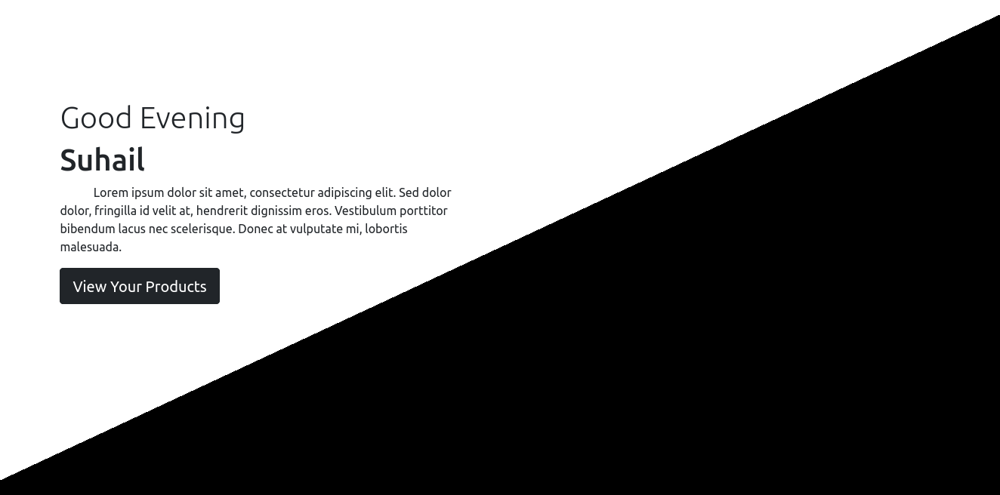
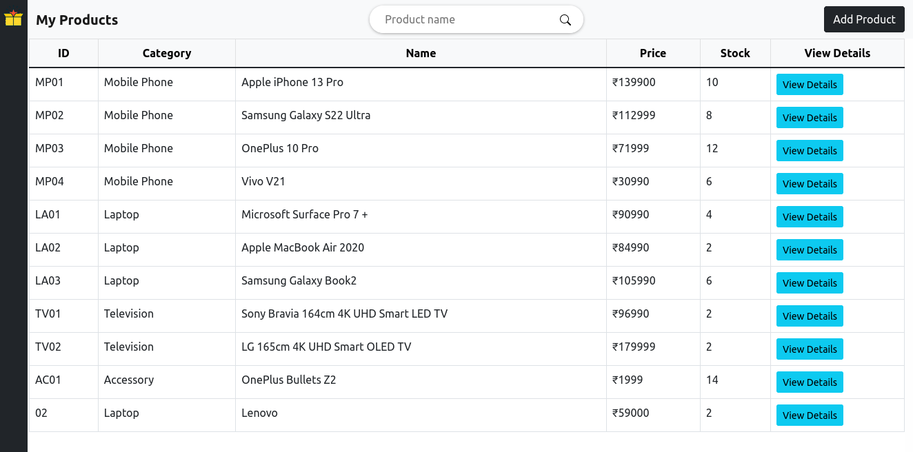
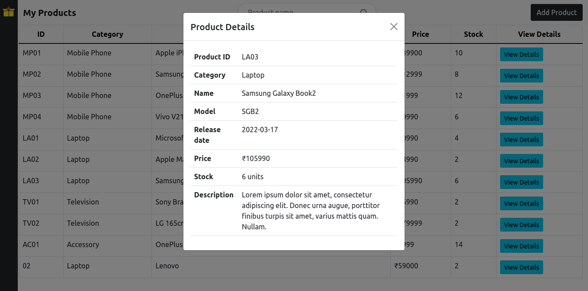
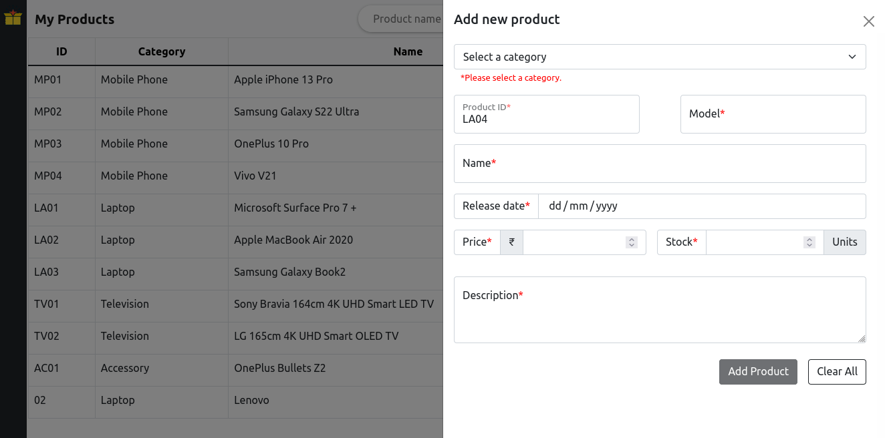

<h2>Angular Assignment 01: Project - My Products<h2>
<ul>
<li>Create an angular application using angular-cli</li>
<li>Create a component for Welcome screen which includes:
    <ol>
    <li>Greetings for the day ex. Good morning, your_name</li>
    <li>Welcome message</li>
    <li>Button -> Click Here(Onclick- Should redirect to product list page).</li>
    </ol>
</li>
<li>Create a component for Product List which includes:
    <ol>
    <li>Make an AJAX api call to fetch product list from JSON server</li>
    <li>Table should contain product_id, name, category, price, stock_units</li>
    <li>Should have button to add new product above the table, clicking on this button redirect to add new product page</li>
    <li>Clicking on the product from the table, should redirect to the details page where the user can see all the details.</li>
    </ol>
</li>
<li>Create a component to Add New Product, it should have form which includes following fields and should have validation on submit :
    <ol>
    <li>Product_id - it should be alphanumeric value</li>
    <li>Name - maximum character length should be 30.</li>
    <li>Category - should be static dropdown (Mobile, Laptop, T.V.,...., possible electronic items)</li>
    <li>Price - it should be float value(100.01rs)</li>
    <li>serial/model number - it should be alphanumeric value</li>
    <li>release_date - it should be past date</li>
    <li>Stock_units - it should be numeric value</li>
    <li>Description - maximum character length should be 150.</li>
    <li>Should have back button to go back on list page</li>
    <li>On successful submission should redirect to List page.</li>
    <li>Pass product_id from route and read that value on details page to show full details of product.</li>
    </ol>
</li>
<li>Create a component to display selected Product Details
    <ol>
    <li>Fetch product list and show only selected record</li>
    <li>Product_id, Name, Category, Price, serial/model number, release_date,
    Stock_units, Description</li>
    <li>Should contain back button to go back on list page</li>
    </ol>
</li>
<li>Use of life cycle hooks</li>
<li>Use routing to redirect user from one page to another</li>
<li>Must follow validation on form fields mentioned next to the field name.</li>
<li>Use bootstrap using CDN for table, buttons and form design</li>
<li>All are individuals component which are highlighted above</li>
</ul>

Home:

Products:

Product details:

Add product:

